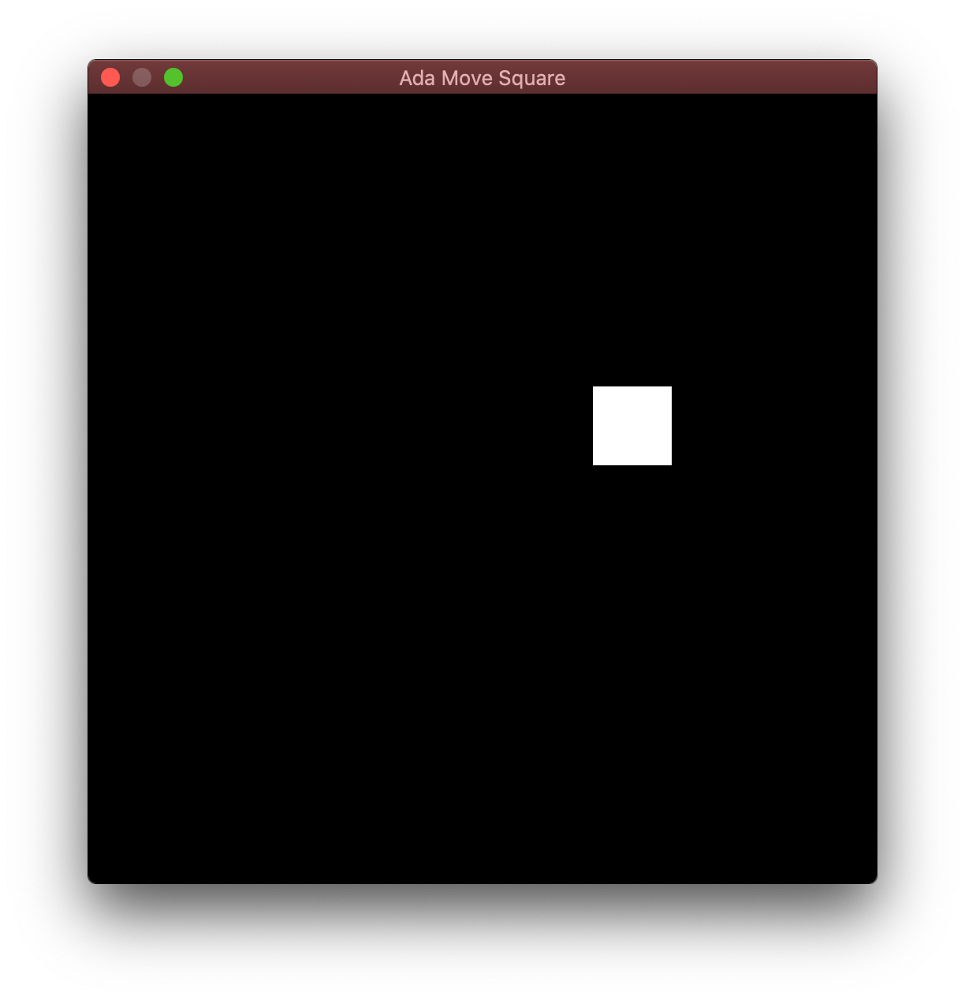

## Move Square C++ vs Zig vs Ada
simple graphical app to test if I want to use Zig or Ada in addition to C++

#### Zig
I like Zig's syntax, especially for importing modules. I think Zig probably has the best import syntax of any language. In Zig, you always know where an identifier comes from and there is no global glob import. A strength and weakness of Zig is that it is very similar to C++/C. It is a procedural language and so you solve problems the same way you would in C or C++. This is great, but I'm not looking to replace C++ so I want something a little more different. But Zig is still very interesting and I'm keeping my eye on it and waiting for the self hosted compiler

#### Ada
Ada is very interesting to me. I don't think I wrote this program in a very Ada way, it doesn't feel like I'm actually taking advantage of Ada's featuers and so I'll continue to play with it. Oddly enough one of the things I find frustrating about Zig is its strict typing and verbose conversion code but super strong typing is Ada's main selling point and I actaully like the way Ada does it. Similar to Zig it has good C interop and can automatically generate bindings (including #define constants) via the gnat ada gcc compiler `gcc -C -fdump-ada-spec some_c_header.h`. I also really like Ada's task system for concurrent and parallel code. Ada feels more different from C++ than Zig does and so I am more interested in it than Zig at the moment. It is very interesitng to try to design a domain for your program and reason about it using specialized types. I think the biggest annoyance with Ada in this project is that Ada only implements bitwise operations for unsigned/modulo types in the interfaces package, however I'm sure this is less of an issue than it seems on the surface.

##### update
Added two new Ada versions. The leg (legacy) version is the original, ada_square2 overloads the + operator for the Pos type instead of using clamp, which I takes more advantage of Ada features. The new ada_square.adb is just a cleaned up and simplified version of teh legacy file and is the shortest and most simple version. Given that the most simple solution is pertty much just an Ada port of the C++ version, I'm not sure there was any benefit to using Ada here. The version that uses the Pos type and overloads the + operator is kind of neat, but I could do the same thing in C++ with a custom type, an int cast operator and operator overloading. 

